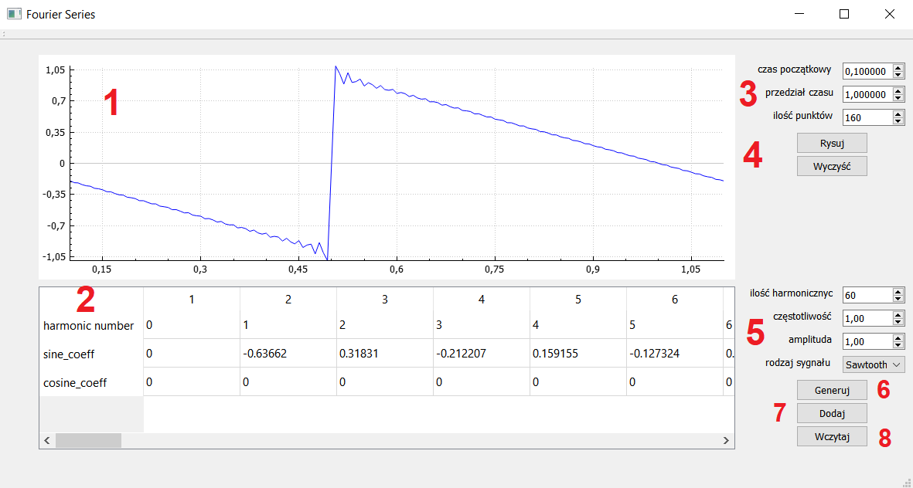

# FourierSeries

Projekt z przedmiotu Języki i metody programowania 2 (Informatyka, WEAIIB AGH)

## Platfora  

  Windows

## Język
C++14

## Użyte niestandardowe biblioteki

  Qt5
 
## Skrótowy opis programu 

Program wczytuje z pliku tekstowego lub generuję szereg fouriera dla wybranych parametrów wejściowych sygnału. 
Współczynniki szeregu można modyfikować w trakcie działania programu poprzez zmienianie wartości w wyświetlonej tabeli. 
Użytkownik ma możliwość wyświetlenia sygnału odpowiadającego danemu szeregowi fouriera.

## Interfejs 

 

<ol>
<li> Wykres wygenerowany z parametrów szeregu fouriera</li>
<li> Tabela zawierajaca współczynniki szerego </li>
<li> Parametry wyświetlanego sygnału</li>
<li> Obsługa wykresu </li>
<li> Parametry generowanego szeregu</li>
<li> Dodaj kolejny wyraz szeregu</li>
<li> Wczytaj współczynniki szeregu z pliku tekstowego </li>
</ol>

